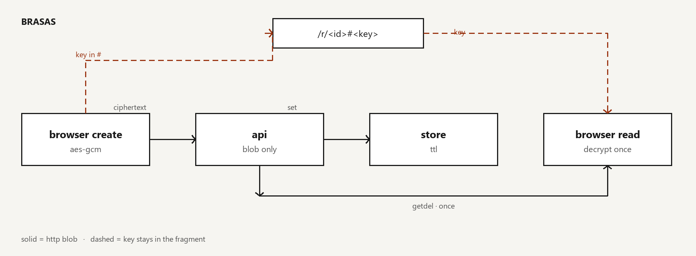

# brasas

Compartí un secreto por un link de un solo uso. El browser cifra con AES-GCM antes de mandarlo; la clave vive solo en el `#` de la URL y el server nunca la ve. El blob tiene TTL y al leerse se quema.

brasas is a one-time secret link: AES-GCM in the browser, key only in the URL fragment, burn-after-read. Self-host with Docker, or use the public demo.

## Demo

https://brasas.briandlhz.space

## Correr

```bash
docker compose up --build
```

http://localhost:8000

## Cómo funciona



1. Clave AES-256 en el cliente (`Web Crypto`).
2. Plaintext se padea a un bucket (512 / 2K / 8K / 32K / 48K) y se cifra con **AES-GCM**.
3. Al API solo va `{ ciphertext, iv, ttl }`. Link: `/r/<id>#<clave>`.
4. Store con TTL (1h / 6h / 24h). Demo: KV. Self-host: Redis.
5. Lectura = get + delete. Si no está: quemado o expirado.
6. El browser descifra con la clave del `#`.

## Self-host

Usá HTTPS. El host del JS es parte del modelo de confianza: si no es tuyo, no asumas zero-knowledge. El server no ve plaintext; sí puede ver tamaño (por buckets), TTL e IP del proxy.

## API

| Método | Ruta | Qué hace |
|--------|------|----------|
| `POST` | `/api/secrets` | Guarda blob → `{ "id" }` |
| `GET`  | `/api/secrets/{id}` | Una vez, después 404 |
| `GET`  | `/api/health` | Health |

## Deploy (Cloudflare)

```bash
npx wrangler deploy
```

## Tests

```bash
pip install -r requirements.txt cryptography
pytest -q
```

## Licencia

MIT · [Brian De La Hoz](https://briandlhz.space) · [@briandlhz06](https://github.com/briandlhz06)
